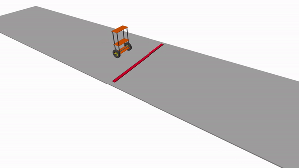
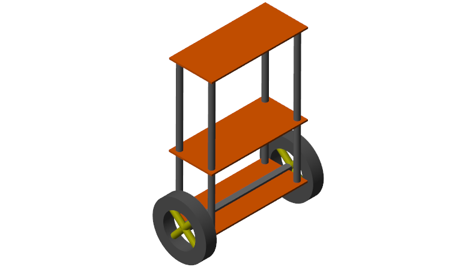
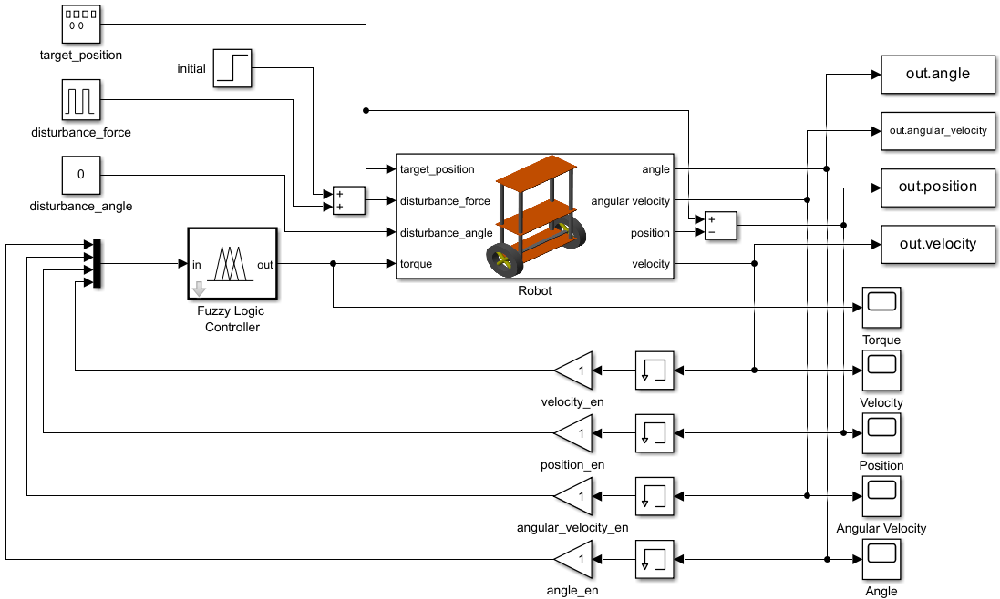
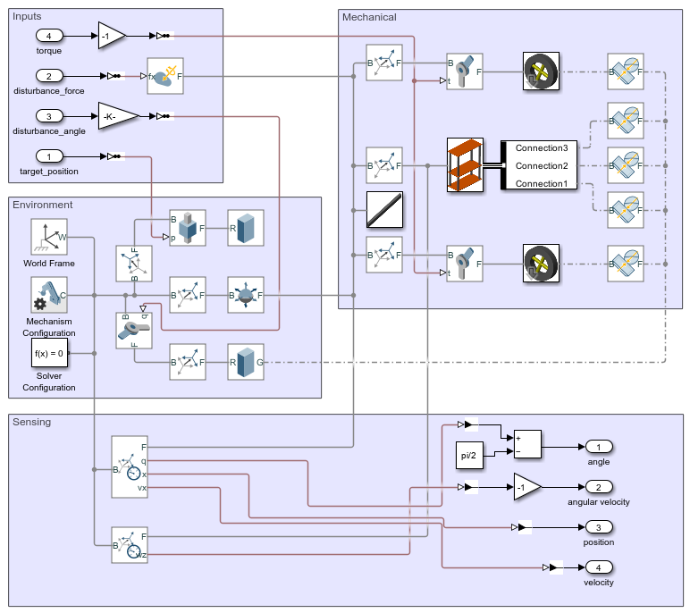

## Demo

## Video
Watch the video that goes with this repository for a primer on fuzzy logic control here: https://www.youtube.com/watch?v=_MahS96EqQA

## IEEE Paper
Read the [IEEE paper](docs/IntuitiveFuzzyLogicControllerDesignUsingMATLABSimulink.pdf) for a more complete understanding of applying intuition to fuzzy logic controller design 

## Simulation
The simulation folder contains the MATLAB/Simulink source code for a 2-wheeled robot and self-balancing controller.

I should note that I'm not sure exactly who created the original robot model as there seem to be many versions now but I adapted mine from a model by Mouad Boumediene [here](https://www.mathworks.com/matlabcentral/fileexchange/88768-two-wheeled-self-balancing-robot).

At a high-level, the model consists of a fuzzy logic controller in a closed-loop with a plant which describes the robot. The controller considers the angle, angular velocity, position and linear velocity of the robot when making decisions.

Simulink multibody was used to describe the physics of the cart by introducing both gravity and friction with the floor into the simulation.

The model also allows the various feedback dimensions to be introduced separately. For example, from left to right, after the changes:
1. No closed-loop feedback
2. Angle only
3. Adding angular velocity
4. Adding position
5. Adding linear velocity

